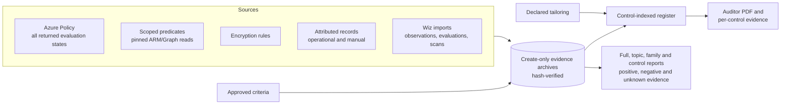

# Cloud governance evidence and audit program

Automated, auditor-facing evidence collection for the NIST SP 800-53 Rev. 5 controls that the Azure resources this team deploys actually implicate. It reads configuration, never changes it, freezes what it saw into a tamper-evident archive, and answers the question an auditor asks: *for this control, what evidence do you have, and what is still missing?*

Encryption at rest was where this started. It is now one rule family among several inputs.

## How it works



Source runs and linked supplements preserve distinct evidence kinds:

| Evidence kind | Where it comes from | What it is good for |
| --- | --- | --- |
| `policy_compliance` | Azure Policy initiative evaluations | Provider-asserted states and Microsoft-declared control mappings; capture all returned outcomes. |
| `configuration_predicate` | 199 registered predicates at pinned API versions | Observations and criteria where Policy leaves evidence gaps. |
| `resource_rule` | Reviewed rules for 49 exact ARM types | At-rest facts and documented service guarantees with explicit exclusions. |
| `attributed_record` | Operational imports, attestations, provider assurance | The organizational controls no API can observe. |
| `wiz_observation`, `wiz_evaluation`, scan records | Project-defined v2 normalized imports | Safe facts, positive/negative source evaluations and scan coverage. Native Wiz mapping awaits workplace access. |

Supplements extend the same archive for facts ARM cannot reach: [restricted Kubernetes metadata](docs/KUBERNETES_EVIDENCE.md), [typed guest and agent reports](docs/GUEST_EVIDENCE.md), and [normalized Wiz evidence](docs/WIZ_INTEGRATION.md).

### Use the platform where the platform is better

Azure Policy supplies provider evaluations and Microsoft-maintained mappings. The intended architecture uses it as the primary configuration evaluator, with direct reads filling explicit evidence gaps. The current execution path still runs direct collection before adding Policy; that transition remains unfinished. See [review and fixes](docs/AZURE_POLICY_REVIEW.md) and [Policy collection boundaries](docs/AZURE_POLICY_EVIDENCE.md).

What the platform does **not** provide, and this program does:

- **Evidence custody.** Hash-verified, immutable, exact-run archives and self-contained auditor PDFs. Policy compliance is a rolling state with limited history.
- **Your criteria, not a vendor's defaults.** Thresholds come from an approved criteria file and are frozen into each run. Absent or draft criteria leave a result UNKNOWN rather than inventing policy.
- **Pinned provenance.** Reads record the exact API version used. Resource Graph and Policy cannot pin an API version into the evidence.
- **Tailoring and inheritance.** A declared register of which controls apply, who owns them, what is inherited from the provider and what is excluded — with a rationale and a named approver.
- **Cross-plane reach.** Microsoft Graph, guest agents, Kubernetes and third-party scanners.

### What it refuses to do

The discipline is the product. It never writes to Azure, never reads secrets, keys, app settings or connection strings, and never invents an organizational threshold. Denied, missing, stale, contradictory and unsupported states are preserved rather than rounded up to a pass. **No status in any report means a control is satisfied** — that determination belongs to an assessor under SP 800-53A, and every collected control carries that limitation explicitly.

## Where it stands

Source baseline **0.27.0 with unreleased evidence-report/Policy/Wiz changes**. Start with the [home-lab checkpoint](docs/HOME_LAB_BUILD_STATUS.md), [current status](docs/STATUS.md) and [control register](docs/CONTROL_REGISTER.md).

| | |
| --- | --- |
| Service entries in the program | 23 |
| NIST families represented in the full evidence index | 20 |
| Registered configuration predicates | 199 |
| Whole-objective/control completion | Not established; open/partial work remains |
| Research objectives catalogued | 215 across 12 domains and all 20 NIST families |

The [predicate execution plan](docs/audit/PREDICATE_EXECUTION_PLAN.md) tracks the remaining work section by section with measured before-and-after numbers. Organization-wide controls with other owners — every `XX-1` policy control, and the PE, PS, AT, PM and PL families — are outside that plan by design; they close through declared inheritance and attributed records, not collectors.

## Clone this to your work tenant

For code and docs together, run `python3 scripts/export_workplace_source.py --output /tmp/workplace-source.zip`; see the [source transfer instructions](docs/WORKPLACE_AZURE_HANDOFF.md#code-and-documentation-together-recommended-transfer). For documentation alone, start with the [six-document transfer list](docs/WORKPLACE_AZURE_HANDOFF.md#exactly-which-documents-to-copy); `python3 scripts/export_workplace_docs.py --output /tmp/workplace-docs.zip` exports that reading set without lab research/history.

The lab and the workplace deployment are deliberately separate. Nothing here hard-codes a tenant, subscription, identity or threshold:

1. Clone a revision containing feature commit `519f8ca` and the handover cleanup. Follow the [fresh-machine setup](docs/WORKPLACE_AZURE_HANDOFF.md#fresh-machine-setup) to install constrained dependencies in a Python 3.12 virtual environment and run `python scripts/validate.py` — the full offline gate, no cloud access required after dependencies are installed.
2. Run `python scripts/demo_audit_evidence.py --output ../audit-rehearsal`, then follow the [handover guide](docs/WORKPLACE_AZURE_HANDOFF.md) and [copyable workplace LLM prompt](docs/prompts/AZURE_ADAPTER_IMPLEMENTATION.md). Review existing Policy assignments before proposing any new assignment.
3. Declare tailoring: `python -m cloud_governance control-register --template tailoring.json` emits the controls your resource types implicate, ready to review and approve.
4. Supply your approved criteria file; see [configuration assessments](docs/CONFIGURATION_ASSESSMENTS.md).
5. Deploy the collector using existing workplace infrastructure patterns and the [runtime contract](docs/WORKPLACE_RUNTIME_CONTRACT.md).

Home Terraform is the temporary personal lab only; it is not the workplace deployment.

## Full or single-topic reports

```sh
python -m cloud_governance evidence-report --store /private/archive --run-id r-EXACT --pdf
python -m cloud_governance evidence-report --store /private/archive --run-id r-EXACT --topic encryption-at-rest --pdf
python -m cloud_governance evidence-report --store /private/archive --run-id r-EXACT --family AC --pdf
```

Use exact archived IDs. Add `--wiz-import-id`, repeated `--operational-id` or a reviewed `--topic-profile` as needed. Reports include good and bad evidence plus coverage gaps; successful publication is independent of failed criteria. The same selection is available through the existing Functions host. See [complete report contract](docs/EVIDENCE_REPORTS.md).

## Start here

[Current status](docs/STATUS.md) · [Architecture](docs/ARCHITECTURE.md) · [Control register](docs/CONTROL_REGISTER.md) · [Azure Policy evidence](docs/AZURE_POLICY_EVIDENCE.md) · [Program scope](docs/PROGRAM_SCOPE.md) · [All-family NIST review](docs/audit/NIST_FAMILY_REVIEW.md) · [Delivery register](docs/DELIVERY_REGISTER.md)

**Development:** macOS or Linux with Python 3.12. **Production target:** Azure Functions with an explicitly selected user-assigned managed identity and separate retained-evidence Blob storage. Start with [portable setup](docs/MACOS_DEVELOPMENT.md) and the [workplace Functions guide](docs/AZURE_FUNCTIONS.md).

## Save a run and produce an auditor PDF

Collection and report generation are separate operations against separate archived objects. The auditor receives one self-contained PDF; the internal JSON preserves collected facts and saved conclusions so a result can be reproduced without recollecting Azure. Historical archives stay frozen: rendering an old run uses its saved facts, criteria and context, never today's rules. Release history is in [the changelog](CHANGELOG.md).

```sh
python3 -m pip install '.[pdf]'
python3 -m cloud_governance collect --fixture examples/demo-fixture.json --store ./evidence/archive
python3 -m cloud_governance runs --store ./evidence/archive
# Use the exact r-... ID printed above; the demo collection exits 1 intentionally.
python3 -m cloud_governance pdf --store ./evidence/archive --run-id YOUR_EXACT_RUN_ID
```

Each collection and PDF generation creates new archived objects. Historical rendering verifies the selected run and uses its saved facts, conclusions and context without recollection or reassessment. Incomplete/corrupt runs cannot be reported as complete. The PDF contains findings, criteria, observations, dependency references, errors and broader audit gaps inside the document.

Index any saved run by control, which is what an auditor asks for:

```sh
python3 -m cloud_governance control-register --input evidence/demo.json --report evidence/controls.md
```

See [local workflow and failure semantics](docs/LOCAL_ARCHIVE_PDF.md), the [workplace Azure handoff](docs/WORKPLACE_AZURE_HANDOFF.md), and [ready-to-use implementation](docs/prompts/AZURE_ADAPTER_IMPLEMENTATION.md) / [validation prompts](docs/prompts/AZURE_ADAPTER_VALIDATION.md). The optional Azure adapter and Functions triggers are implemented, tested offline and validated in the personal lab; deployment and acceptance in the work tenant remain workplace steps. Both hosted operations default disabled. No database or runtime AI is required. The local filesystem adapter requires POSIX support. ReportLab is optional for core collection and required for PDFs.

## Run offline now

Python 3.11+ is required. Collection, assessment and JSON archiving use the Python standard library. PDF output uses the optional ReportLab extra; PDF extraction tests use optional pypdf. For the complete development/test dependencies, follow [the venv setup](docs/MACOS_DEVELOPMENT.md); its validation gate rejects skipped checks. Run from the repository:

```sh
# From the cloned repository root, with your virtual environment active
python3 -m cloud_governance collect \
  --fixture examples/demo-fixture.json \
  --snapshot evidence/demo-snapshot.json \
  --json evidence/demo.json \
  --report evidence/demo.md
```

The fixture is synthetic and makes **no Azure calls, authentication calls or chargeable cloud operations**. It deliberately produces exit code **1**: 35 resources, 22 PASS, 3 FAIL, 7 UNKNOWN, 1 ERROR, 1 UNSUPPORTED and 1 NOT_APPLICABLE. The three failed resource rows represent two underlying conditions: a database with TDE disabled (also reflected on its parent) and Kusto cache-disk encryption disabled. A denied Storage read and workload-storage gaps keep coverage incomplete.

Open [the committed synthetic report](examples/demo-report.md) to see the output without running anything. Its identifiers and findings are examples, not tenant evidence.

```sh
python3 scripts/validate.py
python3 -m cloud_governance catalog
python3 -m cloud_governance assess \
  --input evidence/demo-snapshot.json \
  --json evidence/reassessment.json \
  --report evidence/reassessment.md
```

`assess` does not refresh Azure state. It applies the current rules to the saved, timestamped observation. Reports record a canonical snapshot SHA-256 digest for correlation; snapshots are editable files, not signed attestations.

Optional packaging, if you already have setuptools/pip available: `python3 -m pip install -e .` provides the `cloud-governance` command. Running the module directly does not need installation.

## Live collection — optional and explicitly scoped

The authorized personal lab completed two hosted RG-scoped collections and current/historical PDF generation; see the [live validation results](infra/personal-lab/REPEAT_VALIDATION.md). This does not establish coverage for other services, subscriptions or workplace environments. The offline test suite never invokes live collection. Obtain authorization for each new tenant/scope before collecting its evidence.

After authorization, an operator can run a smoke test **locally** against existing resources. It uses Azure public-cloud ARM management-plane metadata GETs only. It does not provision resources, use a hosted runner, read blobs/database rows, enable diagnostic logs, activate paid services or modify Azure configuration. Offline testing is the established path when no new Azure charges are permitted. Existing subscriptions/resources retain their normal costs; the tool does not assess those costs.

Requirements: Azure CLI installed, an existing authorized sign-in for the correct tenant, public Azure cloud, and metadata read permissions. The local CLI only requests a short-lived ARM token through `az account get-access-token`; it never runs `az login` or changes the active subscription/cloud.

```sh
# Substitute an existing subscription UUID after live testing is authorized.
python3 -m cloud_governance collect \
  --subscription 11111111-1111-1111-1111-111111111111 \
  --snapshot evidence/snapshot.json \
  --json evidence/audit.json \
  --report evidence/audit.md
```

Repeat `--subscription UUID` for multiple subscriptions. Omit it to paginate all subscriptions visible to the CLI identity in its **current tenant**. This does not discover other tenants or subscriptions the identity cannot see. An explicit subscription outside that tenant can fail authentication/authorization; the report records incomplete collection. Sovereign clouds and Azure Stack are not implemented.

[Permissions and collection details](docs/COLLECTION.md) list the read operations and limitations. API versions are pinned; a provider/version/region mismatch results in an error, never a fallback pass.

## Reading the result

| Result | Meaning |
| --- | --- |
| PASS | Positive evidence for the stated resource scope: API configuration, an exact documented service guarantee supported by a successful identity read, or verified dependencies. |
| FAIL | Observed disabling state, or a resolved dependency with a confirmed failure. |
| UNKNOWN | Missing/contradictory fields, incomplete child listings, unresolved dependencies, an unreviewed tier or remaining workload storage gaps. |
| ERROR | A required resource or encryption read failed, including access denial or invalid response identity. |
| UNSUPPORTED | Discovered exact ARM type has no reviewed rule. It remains in the inventory and coverage report. |
| NOT_APPLICABLE | Explicitly justified narrow scope, such as a networking construct or SQL master's unsupported TDE mechanism. It does not certify associated workloads. |

| Exit | Meaning |
| --- | --- |
| 0 | Supported observed scope is satisfied, with no known failures or gaps. Still subject to report limitations. |
| 1 | At least one confirmed failure. `coverage_incomplete` independently indicates remaining gaps. |
| 2 | No confirmed failure, but evidence or coverage is incomplete, unsupported, denied or empty. |
| 3 | Local input/output or schema error; no raw error payload is printed. |

The report includes per-resource identity, collection/assessment timestamps, API and rule versions, scope, result/reason, safe evidence, dependencies, source links and gaps. Inventory traversal, child traversal, unsupported types and collection errors are summarized separately. A partial inventory can contain valid individual passes while the overall result remains incomplete.

## Auditor verification commands

Both report formats include per-resource `verification_commands`. Each entry contains the exact GET URL and API version, shell command and argv, selected-field query, what it checks, expected/saved values, interpretation and service documentation. The Markdown report places commands next to the resource evidence. Resolved dependencies include their separate reads; SQL parents include the child listing and each observed database's TDE request.

Use the commands only after live access is authorized, from a local POSIX shell with Azure CLI and read rights in the correct tenant/public cloud. They retrieve **current** state; they cannot recreate historical proof. Saved snapshots preserve their recorded API versions when generating commands. Generating a report never executes the commands.

Synthetic examples are marked **DO NOT RUN**; demo IDs do not identify deployed resources. Unsupported/not-applicable resources receive inventory-only commands, and unknown/denied results retain their limitations. An identity read is not cryptographic proof: apply the linked Microsoft guarantee only within its stated scope. Configurable mechanisms such as TDE require the separate state read.

List commands show one page with a `more_pages` indicator. Traverse all pages independently; a missing match on one page is inconclusive. Queries select metadata and omit settings/secret values and SAS-bearing URLs; Azure CLI applies projections locally after receiving the ARM response. Keep the projections and avoid debug/raw-response logging. No generated command requests keys, secrets, application data or cloud mutation.

See [Azure CLI REST documentation](https://learn.microsoft.com/en-us/cli/azure/reference-index?view=azure-cli-latest#az-rest) and [query behavior](https://learn.microsoft.com/en-us/cli/azure/use-azure-cli-successfully-query?view=azure-cli-latest).

## Coverage

The [authoritative 23-service program scope](docs/PROGRAM_SCOPE.md) maps the user's service list to current coverage, missing collection planes and deployment-family questions. It governs program scope across selected controls; the executable configuration predicates now add partial support beyond encryption at rest; the delivery register states what remains incomplete.

The [exact rule matrix](docs/COVERAGE.md) is the source for supported ARM types, assessed scopes and Microsoft documentation. Broadly:

- Reviewed service guarantees cover Storage; managed disks/snapshots/images; PostgreSQL/MySQL Flexible Server; Cosmos DB accounts including MongoDB API; Azure DocumentDB Mongo clusters (formerly MongoDB vCore); ACR; backup vault storage; Log Analytics; Event Hubs; Premium Service Bus; AI Search; App Configuration values; Key Vault secrets; reviewed Redis Enterprise SKUs; Grafana-owned storage; Prometheus workspace data; and Automation secure assets/runbooks. Each rule states its exclusions.
- SQL Database, SQL Managed Instance databases and Synapse dedicated SQL pools require explicit TDE endpoint evidence. SQL parents enumerate databases. Kusto requires its separate VM disk-encryption flag as well as the documented backing-storage guarantee.
- AKS, VMs/VMSS, Functions/App Service, Container Apps and Synapse workspaces produce partial workload evidence and explicit gaps. The collector resolves known ARM references and enumerates supported child collections, but does not inspect cluster credentials, application settings or secret connection strings to infer storage.
- Classic Redis persistence, newer Managed Redis SKUs, non-Premium Service Bus and classic Application Insights remain unverified where the current rule lacks sufficient evidence.
- MongoDB Atlas, self-hosted MongoDB internals, Managed HSM, NetApp, Databricks, Data Factory, Service Fabric, HDInsight and other unlisted types have no full rule. Discovery does not imply support. Runtime/data-plane dependencies and arbitrary child types are not exhaustively inventoried.

Private endpoints are explicitly in program scope for resource-local evidence and shared ownership; their current encryption rule is inventory-only and justified N/A. VNet/routing/shared-network administration remains outside the platform scope. Other listed network constructs retain narrow encryption applicability explanations. No network changes are performed.

## Design and extension

`collector.py` supplies a GET-only ARM resource adapter, bounded retries/pagination and an offline transport. `policy_query.py` holds the one read-only query POST Azure requires for compliance state, restricted to a single allowlisted path, a pinned API version and an empty request body. `safety.py` validates resource identity and projects allowlisted evidence. `catalog.py` pins exact types, API versions, scopes and sources. `assessment.py` evaluates evidence and dependencies. `verification.py` creates auditor read commands as data; `report.py` and `cli.py` generate reports and exit status. Tests exercise the same collector path used for live runs.

To add a service: research its Microsoft guarantee and exceptions, add an exact type and reviewed API version, collect only necessary metadata, implement any configurable-state/dependency logic, and add positive, disabled, missing, denied and partial-inventory fixtures. Do not classify an entire provider or all its children by name. Keep unsupported types visible. The [Wiz integration](docs/WIZ_INTEGRATION.md) validates a separate normalized evidence contract and compares it with saved ARM runs. It preserves both sources without treating Wiz findings as ARM observations or changing Azure conclusions. A native Wiz API/export mapper still requires workplace schema/access validation.

ARM collection performs no enforcement, remediation, key rotation or application-secret reads. The optional Blob adapter writes only archive objects in the configured existing container. No resource provisioning, deployment, role changes, messaging or remote repository creation is performed by the tool.

## Future integration direction

Core collection, control evaluation, evidence output and any future core storage path must remain deterministic Python/API operations with **no runtime AI/model dependency or model-call costs**. Versioned structured evidence, stable resource/rule IDs, timestamps, coverage results and replayable snapshots are the foundation for future frequent collection and retained history.

Optional future consumers may include MCP clients used by internal AI tools, uploaded Markdown/PDF knowledge-base documents, APIs and posture dashboards. They can consume core evidence without making collection or evaluation depend on a model. No MCP server, AI integration or dashboard is implemented. The personal Azure lab has completed bounded live collection/report checks and is currently stopped, with no timer or enabled operations. Cloud resources were explicitly authorized for that temporary lab; retained storage may still incur charges. See [current status](docs/STATUS.md) and the [cost/teardown guide](infra/personal-lab/README.md). Workplace infrastructure, scope and acceptance remain separate.

Compare changes between exact archived runs with the [saved-run comparison commands](docs/SAVED_RUN_COMPARISON.md).

Dated restore, access-review, change and incident records can be archived and reported through the [operational evidence supplement](docs/OPERATIONAL_EVIDENCE.md), including explicit missing-evidence requirements.

[Restricted Kubernetes evidence](docs/KUBERNETES_EVIDENCE.md) adds eight per-container workload predicates through exact-run export supplements and opt-in Functions endpoints, including UAMI-authenticated AKS pod/node collection. Local tests cover this adapter; live AKS acceptance remains pending.

[Typed guest and agent evidence](docs/GUEST_EVIDENCE.md) evaluates patch, protection and vulnerability measurements for selected VMs and saved Uniform VMSS instances. This is a normalized export integration, with explicit freshness and missing-population results; vendor-native collection remains separate.
