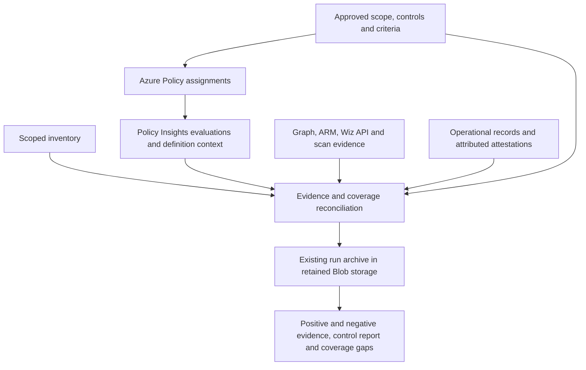

# Azure Policy architecture review and recommended implementation

Reviewed 2026-09-21 against `c316078` (package version 0.27.0). This is a source review and implementation recommendation, not a deployment or workplace acceptance record.

**Baseline review:** the findings/reproduction below describe that original revision. Subsequent local changes fix aggregation, pagination/filtering, Manual-state classification, RG/full-assignment scope and timestamp validation, and add selected reports/Wiz v2. Definition/criteria snapshots, Policy-led execution, multiple partitions and partial-run recovery remain open. See [current build checkpoint](HOME_LAB_BUILD_STATUS.md) and [handover](WORKPLACE_AZURE_HANDOFF.md); do not treat this baseline's line numbers or failure examples as current test results.

**Use Azure Policy as the primary configuration evaluator. Keep this application's evidence archive, historical replay, control index and reporting. Run custom collectors only for explicitly identified gaps.** The Policy pivot is sound; the current execution path still runs the full bespoke collector first and appends Policy results. It has not yet made that architectural transition.

The program covers applicability across all 20 NIST SP 800-53 Rev. 5 control families and all 23 services. Encryption at rest is one topic within that scope. Every applicable objective needs an evidence path or an explicit unresolved gap, including organizational and inherited responsibilities.

**The deliverable is audit evidence collection: preserve positive and negative observations, supporting facts, operating records, exceptions and uncertainty across the assessed population.** A report must let an auditor inspect what is correctly configured and the evidence supporting that observation, as well as what is incorrect or unknown. A successful collection can contain many failed criteria. Keep collection completion/health separate from assessment outcomes; any failure-based gating is an explicit consumer option. Existing CLI semantics require a documented compatibility path when this separation is implemented.

The existing offline gate passed **398 tests, zero skips**. Additional offline reproductions exposed the correctness problems below. No tenant was queried and no Azure configuration was changed during this review.

## Problems that must be fixed first

| Priority | Observed implementation | Consequence and required change |
| --- | --- | --- |
| P1 | `controls.py:588` and `report.py:96` aggregate only resource rules and configuration predicates. | Policy failures and incomplete Policy reads do not affect the overall result or CLI exit. Include every required evidence source in headline status, completeness and exit semantics. |
| P1 | `policy_query.py:108` returns only `payload['value']`, discarding continuation metadata. `policy_compliance.py:116` filters assignment names after truncation. | A partial first page can be called compliant; other assignments can consume the entire 5,000-record allowance. Query by full assignment ID before limiting, consume supported continuation and preserve incomplete collection explicitly. |
| P1 | `control_register.py:104` treats every Policy row alike and gives them empty gaps. | A compliant Manual policy becomes `AUTOMATED_EVIDENCE_COLLECTED`. A truncated Policy section can also produce that status. Separate technical evaluations, attestation states and source completeness throughout the register. |
| P1 | `workflow.py:42` scopes ARM inventory by resource group, but `workflow.py:60` queries subscription-wide Policy state. Assignment matching uses only the name. | A resource-group report can include unrelated resources, and identically named assignments can be mixed. Separate assignment scope from assessed scope; match full IDs and enforce the selected resource boundary. Show relevant parent-scope evidence separately. |
| P1 | `policy_compliance.py:94` checks timestamp length, not validity or age. `fetch_mapping()` reads current metadata and retains only derived control labels. | Invalid timestamps can produce compliant conclusions. Saved rows omit the evaluated definition/version, approved effective criteria, exemptions and baseline context needed to interpret historical state. Archive these explicitly and validate evaluation freshness. |
| P2 | `workflow.py:57` can fail after ARM collection but before `save_run()`. | A denied Policy read prevents useful evidence from being archived. Publish a valid partial run with a structured source failure, retain successful evidence and return an unsuccessful collection outcome. Storage corruption/publication failure remains a separate failure. |
| P2 | `workflow.py:56`, `assignment_url()` and `set_definition_url()` support one subscription with a subscription-level assignment and no management-group initiative path. | The lab path does not support ordinary inherited workplace assignments. Accept full assignment IDs at management-group, subscription or resource-group scope and collect selected subscriptions independently. |
| P2 | The PDF hides all Manual rows; the register still counts them. It also shows definition reference GUIDs without definition titles. | Pending attestations inflate evidence counts; real attestations are hidden with placeholders. Summarize pending manual requirements by owner, show actual attestation provenance, and give technical findings readable names and criteria. |

Reproduced current behavior:

```text
One storage account collected through the real fixture collector and assessor:
  Policy section: FINDINGS_PRESENT
  Overall: SUPPORTED_SCOPE_SATISFIED
  coverage_incomplete: false
  CLI exit: 0

Manual + Compliant -> AUTOMATED_EVIDENCE_COLLECTED
Truncated all-compliant section -> INCOMPLETE section, AUTOMATED_EVIDENCE_COLLECTED controls
timestamp="not-a-date" -> PROVIDER_ASSERTED_COMPLIANT
One-page response with @odata.nextLink -> continuation discarded, compliant conclusion
5,001 unrelated rows before target assignment -> zero target rows retained
Matching assignment name at a different scope -> accepted
```

The first reproduction used `tests.test_controls.fixture()`, restricted its inventory to its storage account, collected through `Collector`, attached a `NonCompliant` Policy record for that account, then called `assess_snapshot()` and `report.exit_code()`. The remaining probes exercised the production projection, transport and register with synthetic inputs. These are local proofs, not observations of failures in a tenant.

The repository's assertion that Policy Insights has no continuation support is too broad. Microsoft's documented **2019-10-01** continuation operation uses POST and a skip token. A query stopped by `$top` is not proof that the API cannot paginate. Validate a complete, assignment-filtered query against the chosen API contract; keep record/page/time limits, but a reached limit must produce incomplete evidence. [Policy States continuation](https://learn.microsoft.com/en-us/rest/api/policyinsights/policy-states/next-link?view=rest-policyinsights-2022-03-01), [current subscription query contract](https://learn.microsoft.com/en-us/rest/api/policyinsights/policy-states/list-query-results-for-subscription?view=rest-policyinsights-2024-10-01).

## Recommended system



### 1. Adopt a controlled baseline using Microsoft's definitions

Reuse the existing NIST SP 800-53 Rev. 5 initiative and any approved workplace assignments. Record their full IDs. Do not create duplicate assignments merely because the collector currently accepts only a subscription assignment name. Microsoft supplies the [built-in NIST mappings](https://learn.microsoft.com/en-us/azure/governance/policy/samples/nist-sp-800-53-r5).

Review effective parameters, enabled definitions, exclusions, exemptions and prerequisites against the actual assessment objectives. A mapping to a NIST control does not establish coverage of every objective. Additional relevant built-in policies can form a small supplemental initiative; write custom Policy definitions only for a verified requirement without a suitable built-in. Keep Microsoft's rule implementations as references rather than copying them into Python.

For this evidence-only program, retain `DoNotEnforce`, disabled modifying/deploying effects and an assignment identity with no remediation roles. Recheck the resolved effects when the baseline changes. `DoNotEnforce` alone still permits manual remediation tasks; the existing extra safeguards therefore matter. Assignment deployment and collector execution use separate authority. [Assignment behavior](https://learn.microsoft.com/en-us/azure/governance/policy/concepts/assignment-structure).

Organization-defined values need an explicit path into approved Policy parameters. Custom gap checks use the existing approved criteria file. Snapshot the baseline identifier and these vetted, non-secret criteria together; two unconnected sets of thresholds would reproduce the current duplication.

### 2. Make collection complete and explainable

Keep Azure Functions and the selected UAMI. Use Policy Insights as the source of Azure Policy evaluations; use Resource Graph for inventory where supported, with existing bounded ARM reads for inventory gaps and required detail. Wiz contributes its own observations, evaluations and history with distinct provenance. Keep one evaluation per source/assignment/reference/resource/component identity and connect it to multiple controls without multiplying the evaluated population. An evaluation can meet or fail a criterion; observed facts may also be retained before an approved criterion exists.

For each selected subscription, gather:

- Scoped inventory and its completeness, independent of whether Policy returned rows.
- Assignment ID, scope, relevant exclusions/selectors/overrides and vetted effective parameters.
- Initiative and definition IDs, readable titles, evaluated versions where available, retained definition content/digests and Microsoft's control mapping.
- Original compliance state, effect, resource/scope identity, evaluation time, collection time and available safe evaluation details.
- Relevant exemptions with rationale and expiry, and actual attestation records with their provenance when available.
- Query interval, pagination progress, failures and the snapshot of approved criteria/tailoring.

Retrieve all relevant evaluation states rather than filtering for noncompliance, open issues or severity. Retain safe observed values and expected criteria for positive and negative evaluations where available. A provider's compliant assertion with no exposed property values remains usable attributed evidence with that limitation; it must not be presented as a direct property observation. Where an audit objective requires more detail, obtain the necessary safe metadata from ARM, Graph or Wiz. Built-in Policy coverage may address a specific encryption requirement, such as customer-managed keys, rather than establish all encryption-at-rest facts; preserve useful existing evidence for those remaining objectives.

Keep original provider assertions even when stale or incomplete; freshness determines whether they are usable as current evidence. Never substitute collection time for evaluation time. Version mismatches between a state and fetched metadata must remain visible. Filter and validate continuation URLs before sending credentials; retain throttling retries, deadlines and bounded responses.

Azure Policy's standard reevaluation cycle is approximately daily, with no fixed completion time for a scan. Start with a daily archive schedule and an owner-approved freshness window. More frequent exports preserve changes but do not force fresh evaluations. [Evaluation triggers and timing](https://learn.microsoft.com/en-us/azure/governance/policy/how-to/get-compliance-data). Resource Graph also requires pagination; it is not an unlimited export endpoint. [Resource Graph result limits](https://learn.microsoft.com/en-us/azure/governance/resource-graph/concepts/work-with-data).

### 3. Replace predicate growth with an objective-to-source register

Reconcile the existing 215 research objectives and 23 service entries. Each objective needs an owner, applicability decision, required population, approved criterion, evidence source and remaining limitation. Count objectives with usable evidence, not definitions mapped to controls.

| Requirement | Preferred source | Custom work retained only when necessary |
| --- | --- | --- |
| Resource configuration such as supported TLS, exposure and encryption settings | Applicable Azure Policy built-ins | Missing definition, unsupported service variant or stricter approved requirement |
| App registrations, service-principal ownership, credential metadata and consent | Existing Graph collector | Explicit identity objectives outside Policy's reach |
| Vulnerabilities, guest patch/protection and workload findings | Existing authorized Wiz/Defender/agent evidence | Validated native mapping and population/freshness reconciliation; the current Wiz importer is not a live integration |
| Wiz-observed resource configuration, evaluated rule outcomes and change history | Wiz API or reviewed native exports, where exposed and enabled | Retain supporting observations, positive evaluations when available, history, scan coverage and original source semantics |
| Build-time security verification | Existing Wiz CLI scan artifacts from authorized pipelines | Associate completed scan reports with artifact digests/commit IDs, scan criteria and timestamps; reconcile to deployment separately |
| Kubernetes configuration | Existing supported Policy/add-on or authorized scanner coverage | Restricted metadata collector for residual objectives; missing prerequisites remain gaps |
| Restore tests, access reviews, change approval and incident exercises | Operational records with owner and assessment period | API metadata for jobs/populations where it supports the stated objective |
| Provider responsibilities and organizational controls | Scoped assurance records and attributed evidence | Human review and recorded inheritance/tailoring |

For every existing bespoke predicate, record `retain`, `replace with Policy`, or `retire from the new collection profile`, with the exact replacement and limits. Stop executing duplicates only after equivalence is demonstrated for scope, criterion, freshness and negative/denied cases. Keep historical readers so old archives remain interpretable.

Reconcile observed results against expected resources and objectives. Missing rows are not automatically nonapplicable: distinguish disabled definitions, unmet prerequisites, exemptions, evaluation pending, missing access and unsupported coverage. Avoid implementing a second general-purpose Policy interpreter to infer applicability; use reviewed scope/type/prerequisite declarations and preserve uncertainty.

### 4. Report decisions and gaps clearly

The default PDF should lead with scope, baseline, freshness, collection health and the complete evidence population: criteria met, criteria not met, unevaluated/unknown states, justified nonapplicability and exceptions. Group evidence by readable policy/objective title with relevant resources, expected criterion, saved observation and owner. Give successful observations the same provenance and traceability as failed observations. Include a control index and a compact appendix sufficient to interpret each result; keep verbose machine-level detail in the archived JSON. An optional findings-only view must be labeled as such and must not replace the complete evidence report.

Manual policies have different semantics: `Compliant` can come from a default or an attestation. A state alone does not establish an authenticated attestation, and neither is an automated configuration observation. Preserve original states including exemptions/errors; keep pending attestations separate from collected evidence. [Microsoft's compliance-state definitions](https://learn.microsoft.com/en-us/azure/governance/policy/concepts/compliance-states).

Report findings and evidence completeness separately so a known failure remains visible even when another source is unavailable. A source-level truncation or denial must propagate into affected control coverage. An empty or partial population must not produce a clean result. Approved inheritance/exclusions remain visible alongside any contrary observations.

Reuse archive integrity checks and exact-run rendering. Conditional Blob writes and hashes are useful, but the existing adapter does not itself establish WORM retention; the runtime contract already acknowledges this. Record and verify the evidence account's approved retention configuration. A retention lock is a separate, irreversible operational decision, not part of this review. [Azure immutable storage](https://learn.microsoft.com/en-us/azure/storage/blobs/immutable-storage-overview).

### 5. Support standalone topic reports

Required report selections are the full program, a named topic, a NIST family or selected controls. Selections can be narrowed to a service or an authorized resource scope. Each report identifies the exact saved run and selected scope. These selectors are planned functionality, not existing CLI options.

For example, **Encryption at rest** produces one self-contained report containing every relevant resource and storage dependency: mechanisms and key-management evidence where required by the approved criterion, observed enabled/disabled states or scoped service guarantees, criteria met and not met, exceptions, evaluation times, source provenance and missing evidence. A correctly configured account remains an evidence row with its supporting facts. Relevant NIST mappings accompany the evidence. An encryption topic is not synonymous with the entire SC family, and a control mapping alone does not make every associated policy relevant to the topic.

Implement topics as versioned, reviewed mappings from assessment objectives to evidence sources: policy definition/reference IDs, custom check IDs, attributed records and required dependencies. Do not select evidence by title keyword or by filtering only the rows already present. Select the required objectives and population first so missing encryption evidence remains visible when no evaluation row exists.

Generate the topic PDF and its machine-readable output from the same saved evidence used by the full report. Historical generation performs no Azure reads and does not reassess facts against today's criteria. Record the report selection and topic-mapping version with the derived artifact; retain the original run unchanged. If an older archive lacks required evidence or mapping context, report that limitation explicitly.

Compute topic summaries and coverage over the selected objectives and population. Preserve relevant scope-level errors, partial collection, stale results and unresolved dependencies. Unrelated findings are outside the selected report; missing or failed evidence relevant to the topic must remain visible. Display dependency evidence outside a narrowed resource scope as supporting context without expanding the assessed population silently.

The operator can generate an encryption-at-rest report and a full NIST report from one run. When current evidence is needed, collect a new run first, then render the requested selection. Topic reporting does not depend on implementing a separate collection engine for each topic.

### 6. Collect Wiz evidence beyond issue summaries

Use the Wiz API or reviewed native exports to obtain the scoped asset population, relevant observed configuration and relationships, rule evaluations where exposed, scan coverage/freshness, and finding lifecycle records. Wiz publicly documents API integrations exporting inventory, configuration findings, vulnerabilities and Issues; the actual fields, positive-result availability and permissions must be verified against the workplace tenant's schema. [Wiz integration data](https://www.wiz.io/integrations/caveonix).

Assess Wiz Audit History as a source for configuration changes and historical configuration/vulnerability findings. Wiz announced resource/configuration history and exports in May 2026, with vulnerability-finding history described as preview in that announcement. Verify current entitlement, retention and API/export availability before promising historical coverage. A platform UI capability alone does not prove that an equivalent API query is available. [Wiz Audit History](https://www.wiz.io/blog/introducing-audit-history).

Ingest existing Wiz CLI scan artifacts for IaC, container images and code from approved development pipelines. Wiz documents CLI integrations producing JSON/SARIF reports. Retain scan identity, target digest or commit, timestamps, tool and rule/policy versions where available, completion state, evaluated coverage, positive policy outcomes when emitted, negative outcomes and exceptions. An empty finding list or process exit code alone proves neither a completed exhaustive scan nor satisfaction of a NIST control. Build-time IaC evidence establishes what was scanned; observed deployed configuration requires separate linkage and evidence. [Wiz CLI scan artifacts](https://www.wiz.io/integrations/harness).

The existing `wiz_evidence` v1 contract supports resource identity/time and issue metadata only; its resource rows cannot carry observed properties or explicit positive evaluations. Implement a versioned extension with separate inventory, observations, evaluations, scan/execution coverage, history and exceptions, while preserving v1 imports. Do not squeeze successful evaluations into fake resolved issues. Feed the new evidence into the same control/topic report model rather than leaving it in a detached comparison report. The [Wiz integration guide](WIZ_INTEGRATION.md) records the required expansion.

Reconcile sources by verified resource/artifact identity and relevant criterion/time. Retain agreement, disagreement and differing scope/age; two tools reading the same underlying fact are corroborating sources, not two resources or necessarily independent measurements. Never silently replace Azure evidence with Wiz evidence. A Wiz Issues query is a useful subset, not a complete inventory or evaluation feed.

## Implementation order and acceptance

1. **Correct the existing Policy path.** Add regression tests for the reproduced bugs; fix headline/exit propagation, full-ID scope matching, continuation, freshness, Manual classification and control completeness. Preserve old archived conclusions as historical records; corrections produce new derived artifacts with explicit provenance.
2. **Ship one complete Policy-led slice.** Storage and Function Apps: approved baseline → scoped inventory → complete Policy retrieval → retained criteria/version context → coverage reconciliation → archive → self-contained report. Include clean, failed, exempt, stale, missing and denied cases. No unrelated custom predicates should be required for the slice to run.
3. **Reconcile all 23 services.** Map each objective to verified Policy coverage, a necessary supplement, attributed evidence or an explicit unresolved item. Reuse proven collectors. Removing code is optional; removing duplicate execution from the new profile is the goal.
4. **Prove workplace operation.** Validate inherited management-group assignments, multiple selected subscriptions, resource-group boundaries, a dataset exceeding 5,000 states, retries, partial failures and missing scheduled runs. Use per-subscription runs and an explicit expected-run manifest; shard further only if measured runtime requires it.
5. **Accept the audit output.** A reviewer can determine what was checked, for which resources, against which criteria, when it was evaluated, what failed and what is missing without interpreting GUIDs or hundreds of placeholder rows. Match a sampled set of findings to Azure's results for the same scope, assignment and evaluation interval. Confirm historical replay and storage retention independently. Generate full-program and encryption-at-rest reports from the same run: shared findings retain identical saved facts, relevant missing/stale/denied evidence stays visible, scope filters preserve dependency context, and rendering neither recollects Azure nor alters the source archive.
6. **Prove evidence completeness and Wiz integration.** A mixed fixture with correctly configured, incorrectly configured, unknown, excepted and unsupported resources retains every applicable population member in full and topic reports. A complete collection containing negative evidence remains operationally complete. Validate real Wiz native API/export and CLI samples, including explicit positive outcomes where supplied, zero-issue scans with and without coverage proof, missing pages, scan errors, resolved/suppressed findings, identity mismatch and source disagreement. Preserve old imports and historical reports. Tenant schemas and authorized samples are external inputs; no live connector is claimed until those contracts and a scoped live run are verified.

Azure Policy on Azure resources currently has no service charge; Functions, storage and optional evidence products retain their own costs. Defender's paid dashboard is not required for direct Policy evidence collection. [Azure Policy pricing](https://azure.microsoft.com/en-us/pricing/details/azure-policy/).

This recommendation preserves the useful archive and hosting investment while moving configuration evaluation to Azure Policy. Completion is demonstrated by correct scoped evidence and visible gaps, not by the number of predicates, controls, tests or report pages.
